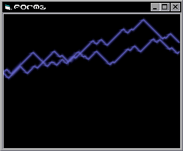



## Anti\-Aliasing,\.\.\. REAL\!\!\! \(see screenshot\)

### Description

This time it's !!!REAL!!!, (not fake like my last post) This uses real Anti-Aliasing, Rnd (so the Bolt isn't always the same). See Screenshot. To be honest i impressed myself... (maybe this is the one... the one to ein code of the month :))) i hope soo ;) and you guys can make it happen by voting... This is a cool addoon for some 3D engines to do stuff like more realistic fire and stuff... (or even Lightning .. lol).
 
### More Info
 

             |
---                |---
**Submitted On**   |2002-04-05 06:41:04
**By**             |[\<\<ULTIMA\>\>](https://github.com/Planet-Source-Code/PSCIndex/blob/master/ByAuthor/ultima.md)
**Level**          |Advanced
**User Rating**    |3.4 (31 globes from 9 users)
**Compatibility**  |VB 6\.0
**Category**       |[Graphics](https://github.com/Planet-Source-Code/PSCIndex/blob/master/ByCategory/graphics__1-46.md)
**World**          |[Visual Basic](https://github.com/Planet-Source-Code/PSCIndex/blob/master/ByWorld/visual-basic.md)
**Archive File**   |[Anti\-Alias68904452002\.zip](https://github.com/Planet-Source-Code/ultima-anti-aliasing-real-see-screenshot__1-33449/archive/master.zip)

